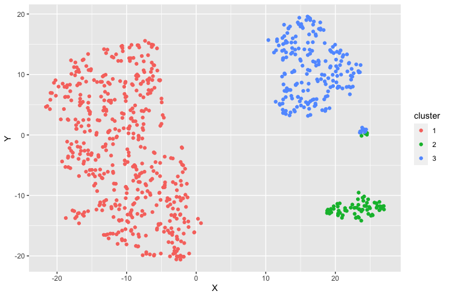

# Clustering-Mixed-Data-types-in-R

Very often we need clustering method where the data types are a mixture of continuous variable, catogorical variables, and variables of binary type. In this project we would discuss an approach to address such situation. As an example we chose a dataset from ISLR package the publicly available "College" dataset.

Let's load the R packages required in this session.
```
set.seed(1680) # for reproducibility

library(dplyr) # for data cleaning
library(ISLR) # This packages has the college dataset
library(cluster) # for calculating gower similarity  matrix and pam
library(Rtsne) # for t-SNE plot
library(ggplot2) # for visualization
```

There are other packages to calculate dissimilarity matrix. We chose this cluster library and would run the daisy function.


Preprocessing the data before clustering.

```
college_preprocessed <- College %>%
  mutate(name = row.names(.),
         accept_rate = Accept/Apps,
         isElite = cut(Top10perc,
                       breaks = c(0, 50, 100),
                       labels = c("Not Elite", "Elite"),
                       include.lowest = TRUE)) %>%
  mutate(isElite = factor(isElite)) %>%
  select(name, accept_rate, Outstate, Enroll,
         Grad.Rate, Private, isElite)
```
glimpse(college_preprocessed)


Remove college name before clustering

```
gower_dist <- daisy(college_preprocessed[, -1],
                    metric = "gower",
                    type = list(logratio = 3))
                                       
gower_mat <- as.matrix(gower_dist)
```

Output most similar pair:

```college_preprocessed[
  which(gower_mat == min(gower_mat[gower_mat != min(gower_mat)]),
        arr.ind = TRUE)[1, ], ]                    
```
Output most dissimilar pair:

```
college_preprocessed[
  which(gower_mat == max(gower_mat[gower_mat != max(gower_mat)]),
        arr.ind = TRUE)[1, ], ]
```   
 We have calculated the dissimilarity matrix and now we would chose a suitable clustering algorithm. We would chose a popular method named partitioning around medoids (PAM).
 
 From wikibook's page, "The PAM algorithm was developed by Leonard Kaufman and Peter J. Rousseeuw, and this algorithm is very similar to K-means, mostly because both are partitional algorithms, in other words, both break the dataset into groups (clusters), and both work by trying to minimize the error, but PAM works with Medoids, that are an entity of the dataset that represent the group in which it is inserted, and K-means works with Centroids, that are artificially created entity that represent its cluster."
 
 
 We would calculate silhouette width for many k using PAM

```
sil_width <- c(NA)

for(i in 2:10){
  
  pam_fit <- pam(gower_dist,
                 diss = TRUE,
                 k = i)
  
  sil_width[i] <- pam_fit$silinfo$avg.width
  
}
```

```
# Plot sihouette width (higher is better)

plot(1:10, sil_width,
     xlab = "Number of clusters",
     ylab = "Silhouette Width")
lines(1:10, sil_width)
```


``` pam_fit <- pam(gower_dist, diss = TRUE, k = 3)

pam_results <- college_clean %>%
  dplyr::select(-name) %>%
  mutate(cluster = pam_fit$clustering) %>%
  group_by(cluster) %>%
  do(the_summary = summary(.))

pam_results$the_summary

```
In PAM method the medoids serve as exemplars of each cluster.
```
college_preprocessed[pam_fit$medoids, ]
```

We can visualize the clusters with t-SNE plot.

```
tsne_obj <- Rtsne(gower_dist, is_distance = TRUE)

tsne_data <- tsne_obj$Y %>%
  data.frame() %>%
  setNames(c("X", "Y")) %>%
  mutate(cluster = factor(pam_fit$clustering),
         name = college_preprocessed$name)

ggplot(aes(x = X, y = Y), data = tsne_data) +
  geom_point(aes(color = cluster))
```


